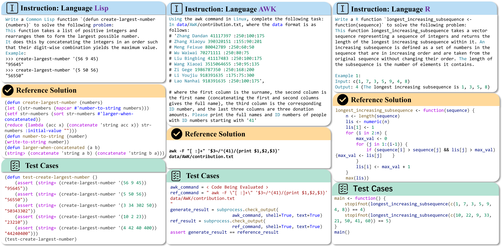
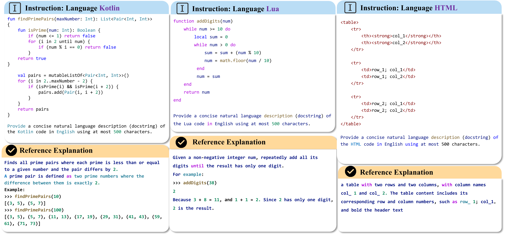
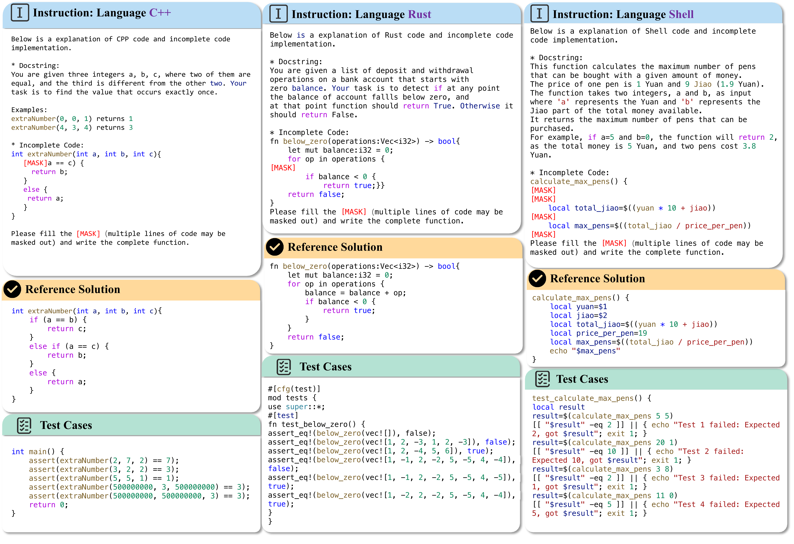
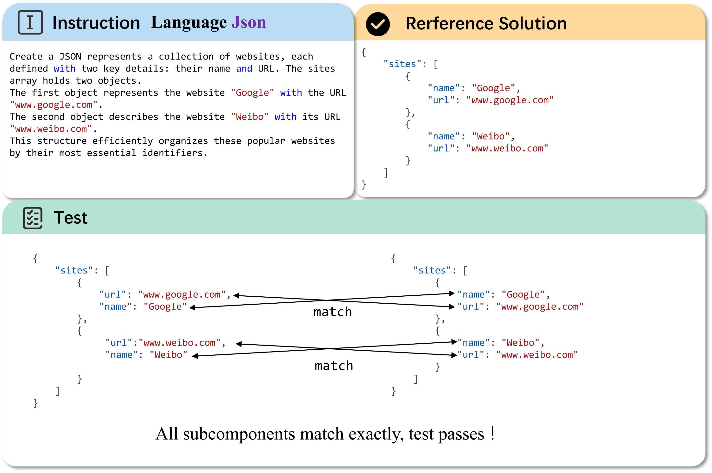

## McEval Examples 

### Multilingual Code Generation 
Examples of multilingual generation. The data mainly consists of an instruction part (including function name, function description, and function call cases), a reference solution, and a test cases part. Left part shows an example of the Lisp language. Middle part shows a file processing programming task in AWK language. During the evaluation, the corresponding file processing result by the generated code will be compared with the reference answer. Right part shows an example of the R language.

### Multilingual Code Explain
Examples of multilingual explanation. The data mainly consists of an instruction part (including a complete function), a reference Explanation. Left part shows an example of the Kotlin language. Middle part shows an example of the Lua language. Right part shows an example of the HTML language.

### Multilingual Code Completion
Examples of multilingual completion. The data mainly consists of an instruction part (including a incomplete function ), a reference complete code solution and test cases. Left part shows an span completion  example of the C++ language. Middle part shows an single line completion example of the Rust language. Right part shows an multiple line completion example of the Shell language.

### Markup Language 
For programming languages other than markup languages, we use an execution-based correctness metric by running the code with the provided test cases. For markup languages, we use the Exact Match metric for evaluation. Taking Json as an example, we parse all subcomponents in Json. If the model result is exactly the same as the subcomponent of the reference solution, the model generation result is considered correct. An example of Markup language (Json) is shown in below figure.

